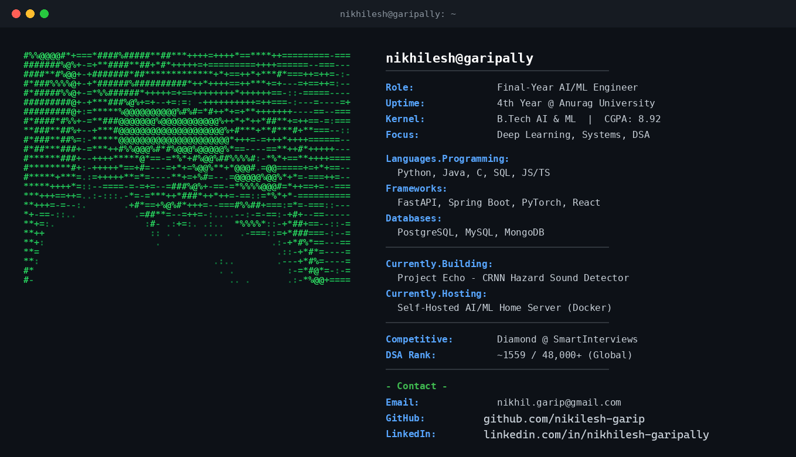

<!-- Profile README for Nikhilesh Garipally (nikilesh-garip) -->

 

  

 

## About Me

- 🎓 Final-year **B.Tech AI & ML student** at Anurag University, Hyderabad
- 🤖 Interested in **AI/ML Engineering, Generative AI, NLP, Computer Vision & Neural Networks**
- 🐍 Strongly focused on **Python, Machine Learning, DSA & Backend Development**
- 🧠 Building projects with **LLMs, Hugging Face, FastAPI, RAG, embeddings & AI agents**
- 🔧 Experienced with **Docker, Git, MongoDB, Supabase, SQL & REST APIs**
- 🚀 Built projects across **AI-powered applications, audio classification, document processing, chatbots & computer vision**
- ☁️ Hands-on with deployment and cloud development, including **Docker, Render and Vercel**
- 🔬 Interested in turning research/AI ideas into **practical, deployable systems**
- 💻 Currently preparing for **AI/ML Engineering opportunities and internships**
- 📫 Reach me at [nikhil.garip@gmail.com](mailto:nikhil.garip@gmail.com)

 

## 🧰 Tech Stack

 

## 🐍 Contribution Snake

<!--
  This animates automatically once the "Generate Snake Animation" GitHub Action
  (already included in .github/workflows/snake.yml) runs for the first time.
  It reads your real contribution graph and renders a snake eating it.
-->

  <picture>
    <source media="(prefers-color-scheme: dark)" srcset="https://raw.githubusercontent.com/nikilesh-garip/nikilesh-garip/output/github-contribution-grid-snake-dark.svg" />
    <source media="(prefers-color-scheme: light)" srcset="https://raw.githubusercontent.com/nikilesh-garip/nikilesh-garip/output/github-contribution-grid-snake.svg" />
    
  </picture>

 

## 📊 GitHub & Activity Stats

  
  

 

## 🚀 Featured Projects

<table>
<tr>
<td width="50%" valign="top">

### 🔊 Project Echo — Hazard Sound Detection
Custom **CRNN trained from scratch** (not an LLM wrapper) to classify 8 hazardous audio classes in real time — two-pass inference pipeline, CrossEntropyLoss + Adam, trained on FSD50K.

`PyTorch` `CRNN` `Signal Processing` `Docker`

</td>
<td width="50%" valign="top">

### 🖥️ Self-Hosted AI/ML Home Server
Turned a spare laptop into a Linux server hosting AI/ML services — Docker Compose, PostgreSQL, Nginx reverse proxy, and Portainer for deployment management.

`Ubuntu` `Docker` `PostgreSQL` `Nginx`

</td>
</tr>
<tr>
<td width="50%" valign="top">

### 🎬 YouTube Smart Chapter Generator
Chrome extension + FastAPI backend that auto-generates chapters using vector embeddings for topic-transition detection (~90% alignment) and the Groq API for titles in <1.5s.

`FastAPI` `Vector Embeddings` `Chrome Extension`

</td>
<td width="50%" valign="top">

### 🤝 Beacon AI — Welfare Eligibility Portal
Full-stack platform checking eligibility across 12+ welfare schemes, with an AI-assisted form-filling workflow and secure relational schemas.

`TypeScript` `React` `Supabase`

</td>
</tr>
</table>

 

  

